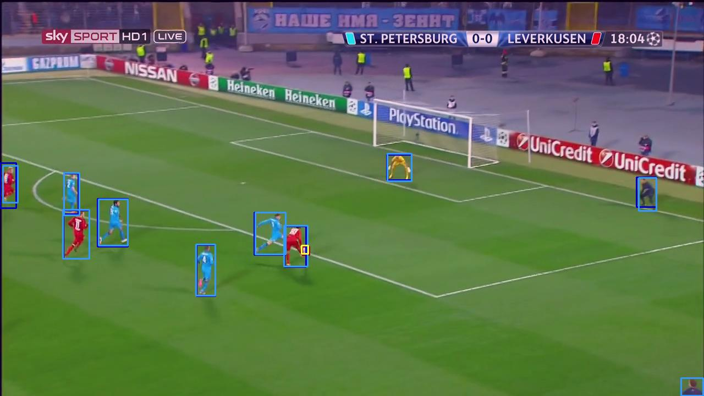
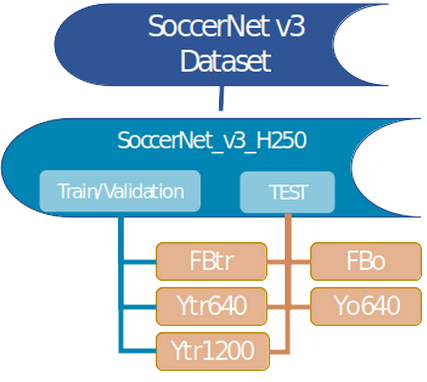

## *Setting a baseline in long-shot and real-time player & ball detection in Football*
**[Setting a baseline ... ](https://ifipaiai.org/2023/)** AIAI 2023 León, Spain. 

Created by [Kostas Moutselos](mailto:kmouts@unipi.gr),
and Ilias Maglogiannis
at <a href="https://cbml.ds.unipi.gr"> CBML </a>

### Abstract
Players and ball detection are among the first required steps on a football analytics platform.
Until recently, the existing open datasets on which the evaluations of most models were based,
were not sufficient. We point out their weaknesses, and with the advent of SoccerNet v3, we
propose and deliver to the community an edited part of it, in YOLO normalized annotation format,
for the reliable evaluation of related models [https://github.com/kmouts/SoccerNet_v3_H250]. 
The code of the methods and metrics are also available so that they can be used as a
benchmark in future comparisons. The recent YOLO8n model proves better
than FootAndBall in long-shot real-time detection of the ball and players on football fields.

### System overview

### Code
This repository is a clone of <a href="https://github.com/jac99/FootAndBallFootAndBall"> FootAndBall<a/> where various modifications/additions have been made.
Code from <a href="https://github.com/SoccerNet/SoccerNet-v3">SoccerNet v3</a>, 
<a href="https://github.com/ultralytics/ultralytics"> Ultralytics YOLO v8  </a>
and other sources have been heavily used. Links
have been added in source comments.

### Citation
If you find our work useful, please consider citing:

    @conference{AIAI 2023 19th International Conference on Artificial Intelligence Applications and Innovations,
    author={Konstantinos Moutselos and Ilias Maglogiannis},
    title={Setting a baseline in long-shot and real-time player & ball detection in Football},
    booktitle={Proceedings of the 19th International Conference on Artificial Intelligence Applications and Innovations},
    year={2023},
    pages={-},
    publisher={Springer},
    organization={IFIP AIAI},
    doi={},
    isbn={},
    }
    
### Environment and Dependencies
Code was tested using Python 3.8.15 with PyTorch 1.13.1 on Ubuntu 22.04.2 LTS with CUDA 11.6.

### Datasets
* <a href="https://github.com/kmouts/SoccerNet_v3_H250">SoccerNet v3 H250</a> 
* <a href="https://github.com/SoccerNet/SoccerNet-v3">SoccerNet v3 </a> 
* <a href="https://drive.google.com/file/d/1Pj6syLRShNQWQaunJmAZttUw2jDh8L_f/view?usp=sharing" target="_blank">ISSIA-CNR Soccer dataset</a> 
* <a href="http://www.cs.ubc.ca/labs/lci/datasets/SoccerPlayerDetection_bmvc17_v1.zip" target="_blank">SoccerPlayerDetection_bmvc17_v1 dataset</a>
<a href="https://drive.google.com/file/d/1ctJojwDaWtHEAeDmB-AwEcO3apqT-O-9/view?usp=sharing" target="_blank">(alternative link)</a>
. 

  
### License
Our code is released under the MIT License (see LICENSE file for details).
We have added the Licenses from FootAndBall, Ultralytics YOLO 8, SoccerNet v3.

